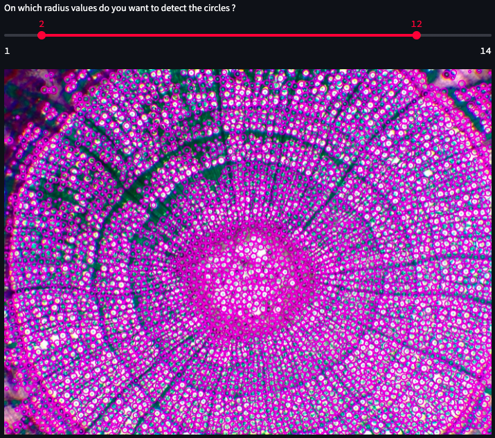
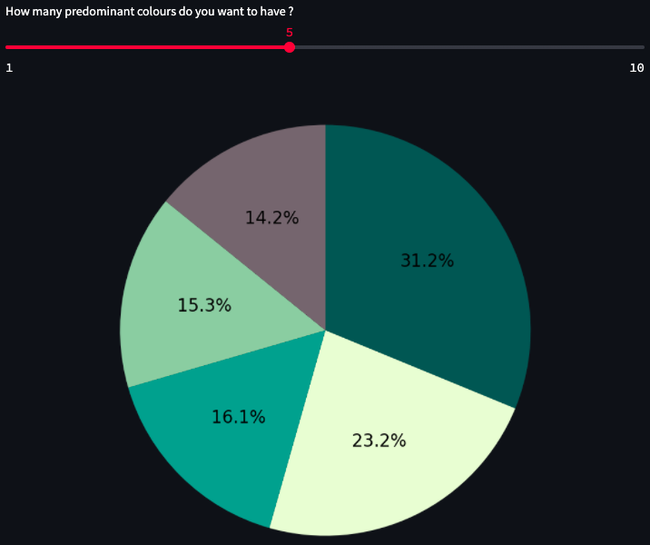
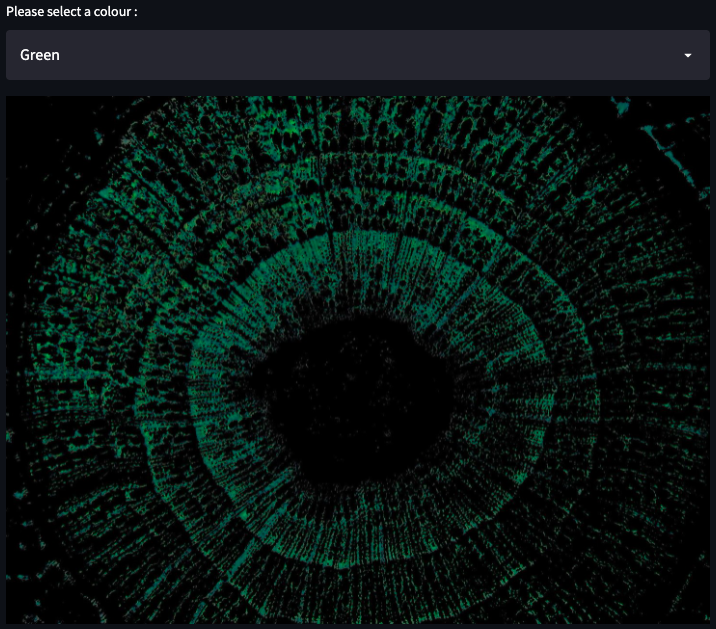
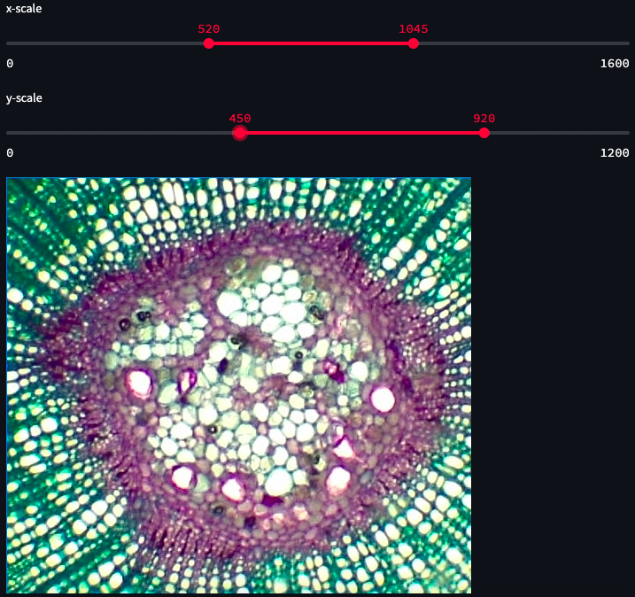
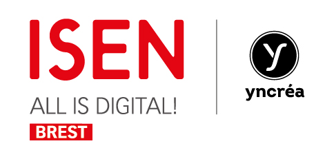

# Automated cross-section analysis

## Welcome to our app !

The automated analysis of thin sections of object samples (algae, plants, and others) for the quantification of physico-chemical parameters is an important issue in the field of microscopy observations.

## Why did we create this app ?

Currently, the majority of the analyses are performed manually by a human observer.

This poses several difficulties:

- The time needed to read and analyse the section can sometimes be very long and this will require the full attention of the technician.

- The evaluation of the sample is made very subjective by the laboratory technician (sight, sensitivity, precision, etc.) making the result very operator-dependent.

- The sequence of analyses can be very monotonous, and the technician's concentration cannot be the same for all the manipulations.

The aim of this application is to remove the subjective character of the analysis while facilitating the work of the manipulator. The analysis time is also reduced, and satisfactory results can be obtained with complete objectivity.

## What are the main features of this app ?

1. Select an image from database or Upload it

* The manipulator can choose an image from a pre-existing database, or he can drag and drop his own image which he wishes to analyse.

2. Counting circles in the image

* A count of the number of circles as a function of radius can be performed with a report on the results obtained.

  

3. Detection of predominant colours

* An analysis of the predominant colours can be performed.

  

4. Select a specific colour

* A selection of a particular colour is possible to give an idea of the pigments present on the image with a report of the result of the analysis.

  

5. Crop a part of the image

* The possibility to crop the image to focus the analysis on a particular element.

  

### Deployed Model

Our model is deployed [online here](https://share.streamlit.io/nathanpouliquen/projet_m1/main/automated_analysis_app.py)!

In order to obtain SATISFACTORY RESULTS, please make sure that the image you want to analyse is of the BEST POSSIBLE QUALITY.

## Abstract

L’analyse de coupes observées au microscope est un travail difficile qui nécessite une expérience et une rigueur très importantes chez le technicien de laboratoire. De nos jours, il existe peu d’outils permettant de réaliser une expertise automatisée des échantillons récoltés pour aider les chercheurs à identifier les éléments d’intérêt. C’est dans ce contexte que le projet a vu le jour. L’objectif de ce travail est en effet d’améliorer l’efficacité d’observation d’images microscopiques grâce au développement d’algorithmes spécialisés dans le traitement d’images. Le développement des techniques de reconnaissance et les avancées dans le domaine de l’intelligence artificielle sont aujourd’hui une réelle chance pour permettre des avancées majeures dans le milieu des analyses microscopiques.
        
Un intérêt supplémentaire de ce projet est de démontrer la valeur des compétences acquises pendant le programme d’études au sein de l’ISEN Brest. Cette mission permettra en effet de valider les capacités d’analyse, de synthèse ainsi que les bases de programmation qui ont été enseignées pendant les 4 années de la formation d’ingénieur.

## About the team

  

We are students in the second year of the engineering cycle at ISEN in Brest. We carried out this project as part of our studies to validate the skills acquired throughout the year and also to facilitate the work of laboratory technicians by reducing analysis time and making the data collected as reliable as possible.

### Contact information :

Nathan POULIQUEN : Master Marine Technologies [LinkedIn](https://www.linkedin.com/in/nathan-pouliquen/)

Emma LUCAS : Master Technologies Biomédicales [LinkedIn](https://www.linkedin.com/in/emma-lucas-972049173/)
